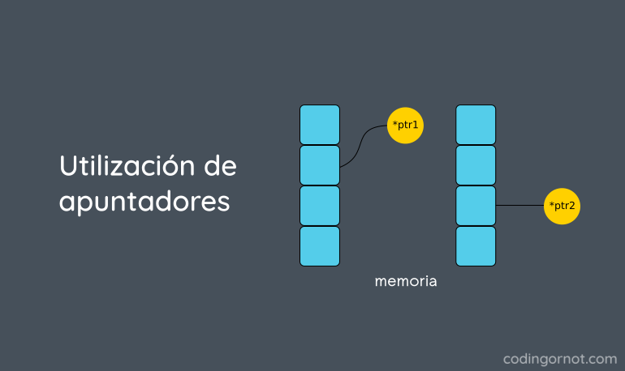

## CLASE 7 : **Estructura con punteros**
___
___

* > Definición de punteros 

Los punteros son variables cuyos valores son direcciones de memoria. Por lo general,
una variable contiene un valor específico, un entero, un flotante, un carácter, etc. En
cambio, una variable puntero contiene la dirección en memoria de una variable que contiene
un valor específico. De esta manera, mediante el nombre o el identificador de una variable,
hacemos referencia directa a un valor. En cambio, mediante el nombre o identificador de un
puntero, hacemos referencia indirecta a un valor. Al proceso de referenciar a un valor a
través de un puntero, se le llama indirección.



* > ## Punteros y estructuras.

Al igual que con el resto de tipos de variables, C permite crear variables punteros a estructuras. La forma de declarar estas variables es:

____
```c++ 
    struct nombre_estructura *nombre_varible_estructura; 
``` 
___
            
Para poder acceder a los elementos individuales de una variable puntero a estructura se utiliza el operador -> (el operador, denominado comunmente flecha, está formado por un signo menos seguido de un signo de mayor, sin ningún espacio en blanco entre ellos). Siguiendo con el ejemplo anterior de las coordenadas, vamos a definir un puntero a una variable de estructura de la siguiente forma:

____
```c++ 
    struct coordenada a, b, *p, *q;

    a.x = 5;
    a.y = 23;
    a.z = 10;
    
    b = a;
    p = &b; /* &b nos devuelve la dirección de la estructura b */
    
    p->x = 2;
    p->y = a.y;
    p->z = a.z;
    
    q = p; /* p y q apuntan a la misma estructura */
 ```
 ___
            
Al igual que ocurría en el apartado anterior también existe la posibilidad de declarar tablas de estructuras. El formato sería el siguiente:

____
```c++ 

    struct nombre_estructura *nombre_varible_estructura[N];
            
ó

    struct nombre_estructura *nombre_varible_estructura[N][M];
```
____
            
Por supuesto también se pueden declarar tablas de punteros a estructuras de más de dos dimensiones pero al igual que ocurría con la declaración de tablas de tipos de datos básicos, no suelen ser muy usadas.

Un ejemplo de declaración de un vector de punteros a estructuras y un acceso al campo de una estructura sería la siguiente:

____
```c++ 

    struct coordenada coor1, *vector_punteros_coordenadas[10];
    
    vector_punteros_coordenadas[4] = &coor1;
    vector_punteros_coordenadas[4]->y = 2;
```
___

* > ## Ejemplo Relizado en Clases:

____
```c++ 
#include <iostream>
#include <string.h>
using namespace std;

struct mascota
{
    //int  id;
    char name[20];
    char *ptrName;
};  //lstMascotas[2];
//}kitty, *ptrKitty = &kitty;

mascota gatito, *ptrGatito = &gatito;
void datosGatito() {
    cout << "Ingrese su nombre: ";
    cin.getline(ptrGatito->name, 50, '\n');

    cout << "ptrGatito: "   << ptrGatito->name  << endl;
    cout << "gatito: "      << gatito.name  << endl;
}

void datosGatitoParametro(struct mascota *ptrCat) {
    cout << "Ingrese su nombre: ";
    cin.getline(ptrCat->name, 50, '\n');

    cout << "ptrCat: "   << ptrCat->name  << endl;
    //cout << "cat: "      << ptrCat.name  << endl;
}

int main()
{
    //1.
    datosGatito();
    cin.get();
    //2.
    mascota lstMascotas[2];
    for (int i = 0; i < 2; i++)
    {
        cout<<"Nombre de mascota: ";
        fgets(lstMascotas[i].name,20,stdin);
        
        int len = strlen(lstMascotas[i].name);
        lstMascotas[i].ptrName = (char *)malloc(len * sizeof(char));
        if(NULL == lstMascotas[i].ptrName )
            cout<<"No hay memoria";
        else{
            strcpy(lstMascotas[i].ptrName , lstMascotas[i].name );
            //free(lstMascotas->ptrName);
        }
    }
    
    for (auto &&m : lstMascotas)
        cout<<m.ptrName;
    
    //3.
    mascota *p =  new  struct mascota;
    datosGatitoParametro(p);
    cin.get();

    /////////////
    return 0;
}
```
____


