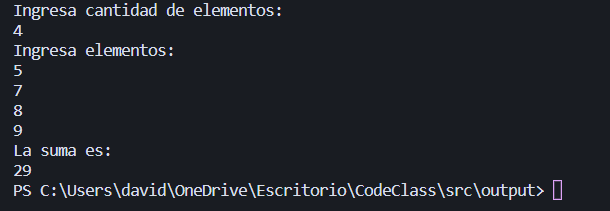

## CLASE 8 : **Suma de Punteros**
___
___

Como su nombre lo dice es la utilización de los punteros a la hora de sumar algo 

* > ## Ejemplo realizado en clase:

____
```c++ 

#include <iostream>
using namespace std;

int * a;
int sum(int* a, int n) {
    if (n == 0) {
        return 0;
    }
    return sum(a, n - 1) + a[n - 1];
}

int main() {
    int n = 0;
    int * a;

    cout<<"Ingresa cantidad de elementos:" <<endl;
    cin >> n;
    if( n <= 0)
        return 0;
    a = new int[n]; //Reserva dinamica de memoria para n enteros

    cout<<"Ingresa elementos:" <<endl;
    for( int i = 0; i < n; i++)
        cin >> a[i]; //Obtienes cada entero
    
    cout<<"La suma es:" <<endl;
    cout << sum(a, n) << endl;
    delete[] a; //Elininas la memoria reservada

    return 0;
}
``` 
___



